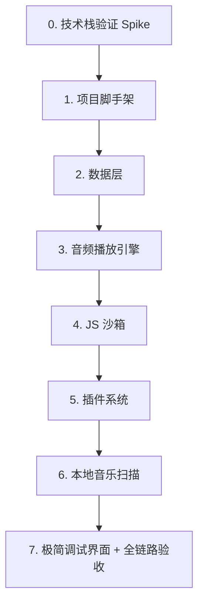

# robyne：多端本地音乐播放器项目开发文档 (第一阶段：底层逻辑篇)

## 1. 项目愿景与设计哲学
* **项目名称**：`robyne`
* **目标平台**：Android、Windows (首期优先)；macOS (次期)。
* **核心策略**：**逻辑与界面彻底解耦（Backend-First）**。首期不设计任何复杂的 UI，仅使用最基础的组件展示调试信息。所有的业务逻辑、网络访问、音频流管理和 JS 脚本执行全部通过状态管理框架暴露为 API。
* **核心卖点**：支持用户导入自定义 JS 脚本，兼容 MusicFree 插件生态，实现一键搜索、解析与播放。

---

## 2. 技术栈选型

> 选型原则：优先选择维护活跃、社区规模大、多端验证充分的库。

| 模块 | 推荐库 | 选型理由 | 风险与备注 |
| :--- | :--- | :--- | :--- |
| **状态管理** | `flutter_riverpod` + `riverpod_generator` | 现代、安全、支持自动生命周期管理。 | 无显著风险 |
| **本地数据库** | `drift` (SQLite) | 成熟稳定，强类型，多端支持完善，代码生成成熟。 | 学习曲线略高于 NoSQL 方案 |
| **音频播放** | `just_audio` + `audio_service` | 跨平台音频播放的行业标准，支持系统通知栏控制。 | audio_service 在 Windows 上的媒体控制需额外验证 |
| **JS 执行引擎** | `flutter_js` | 跨平台支持，在 Windows 上使用 QuickJS。 | 旧版本桌面端存在已知稳定性问题，新版本表现需在 Step 0 验证。|
| **网络请求** | `dio` | 承接 Dart 侧的真实请求，支持配置 Proxy 与拦截器。 | 无显著风险 |
| **标签修改** | `audio_metadata_reader` | 纯 Dart 实现，跨平台读取和修改 MP3/FLAC 的 ID3 信息。 | 社区较新，需验证稳定性；备选 `flutter_media_metadata` |

---

## 3. 核心模块架构与实现原理

### 模块 A：JS 沙箱与 MusicFree 兼容层 (`js_sandbox`)

这是项目的灵魂。需要模拟一个类似于 Node.js/CommonJS 的运行时环境：

#### 3A.1 基础库预装（Assets 注入）
在 Flutter 中准备好 `cheerio.min.js` (网页解析)、`he.min.js` (编码转换)、`crypto-js.min.js` (加密计算) 等静态文件，并在启动沙箱时首先在 JS 环境中执行它们。

#### 3A.2 CommonJS 模拟
在 JS 运行时注入全局变量 `module = { exports: {} }` 和 `exports = module.exports`，并实现全局 `require()` 方法，根据名称返回预装的库。

#### 3A.3 Axios 请求重定向（网桥）
在 JS 运行环境中模拟 `axios`。当插件调用 `axios.get(url, config)` 时，拦截该调用，将其序列化为 JSON，通过 `flutter_js` 的消息通道传回 Dart 侧。Dart 侧使用 `Dio` 发送真实请求后，将结果通过 Promise 的 `resolve/reject` 回传给 JS。

#### 3A.4 沙箱安全策略
运行用户导入的 JS 脚本存在安全风险，必须实施以下限制：

| 安全措施 | 说明 |
| :--- | :--- |
| **执行超时** | 单次 JS 函数调用设置 30 秒超时，超时强制终止 |
| **内存限制** | 限制 JS 堆内存上限（建议 50MB），超出则终止 |
| **网络限制** | JS 侧不可直接发起网络请求，必须通过 Axios 网桥（Dart 侧可审计/限流） |
| **文件系统隔离** | JS 脚本不可直接访问本地文件系统，所有 I/O 通过 Dart 侧代理 |
| **错误隔离** | 单个插件执行异常不得影响其他插件或主进程 |

#### 3A.5 Isolate 线程隔离
JS 脚本在执行复杂的加密计算（crypto-js）或解析大型 HTML（cheerio）时会消耗大量 CPU，若在 UI 主线程运行将导致界面卡顿。

**推荐方案**：将 `SandboxManager` 运行在独立的 Dart Isolate 中。主线程通过 `SendPort`/`ReceivePort` 与沙箱 Isolate 通信：发送搜索请求 → 后台执行 JS → 返回结果 → 主线程更新 Riverpod 状态。

**Axios 网桥在 Isolate 中的工作方式**：JS 代码中的 axios 调用需要回到主线程使用 Dio 发送 HTTP 请求。沙箱 Isolate 通过通信通道将请求参数发回主线程，主线程执行 Dio 请求后将结果回传。

**降级方案**：如果 `flutter_js` 依赖 Platform Channel 无法在非主 Isolate 运行，则将纯计算部分（cheerio HTML 解析、crypto 加密）通过 `Isolate.run()` 包装到后台执行，JS 引擎本身留在主线程。此决策在 Step 0 中验证。

---

### 模块 B：音频播放引擎 (`audio_core`)
基于 `just_audio` 封装全局唯一的播放状态机：

1. 接收从插件解析出来的音频 URL，支持网络流和本地文件路径。
2. 对接 `audio_service`，确保在 Android 端锁屏、系统通知栏以及 Windows 系统的媒体控制中心能正确显示歌曲名、歌手，并能正常控制播放/暂停/上一曲/下一曲。
3. 暴露实时的播放进度、缓冲进度和播放状态（准备中、播放中、已暂停、已结束）。

#### 3B.1 播放队列管理
| 功能 | 说明 |
| :--- | :--- |
| **队列模型** | 维护有序的 `List<SongEntity>` 作为播放队列，暴露 `currentIndex` |
| **播放模式** | 顺序播放、随机播放（Fisher-Yates 洗牌）、单曲循环、列表循环 |
| **队列操作** | 支持插入下一首、添加到队尾、移除、清空、拖拽排序 |
| **持久化** | 当前队列和播放进度持久化到数据库，应用重启后恢复 |

---

### 模块 C：本地存储与数据实体 (`database`)

使用 `drift` 定义四张核心表：

#### 3C.1 插件表 (`plugins`)
| 字段 | 类型 | 说明 |
| :--- | :--- | :--- |
| id | INTEGER PK | 自增主键 |
| name | TEXT | 插件名称 |
| author | TEXT | 插件作者 |
| version | TEXT | 插件版本 |
| local_path | TEXT | 本地 JS 文件存储路径 |
| subscription_url | TEXT | 订阅源链接（可为空） |
| is_enabled | BOOLEAN | 是否启用 |
| installed_at | DATETIME | 安装时间 |

#### 3C.2 歌曲表 (`songs`)
| 字段 | 类型 | 说明 |
| :--- | :--- | :--- |
| id | INTEGER PK | 自增主键 |
| source_id | TEXT | 来源平台的歌曲 ID |
| title | TEXT | 歌曲标题 |
| artist | TEXT | 歌手名 |
| album | TEXT | 专辑名 |
| cover_url | TEXT | 封面图 URL |
| cover_local | TEXT | 本地封面路径 |
| audio_url | TEXT | 音频源链接 |
| duration_ms | INTEGER | 时长（毫秒） |
| is_local | BOOLEAN | 是否为本地文件 |
| local_path | TEXT | 本地文件路径（is_local=true 时有值） |
| plugin_id | INTEGER FK | 来源插件 ID（在线歌曲） |

#### 3C.3 歌单表 (`playlists`)
| 字段 | 类型 | 说明 |
| :--- | :--- | :--- |
| id | INTEGER PK | 自增主键 |
| name | TEXT | 歌单名称 |
| created_at | DATETIME | 创建时间 |

#### 3C.4 歌单-歌曲关联表 (`playlist_songs`)
| 字段 | 类型 | 说明 |
| :--- | :--- | :--- |
| playlist_id | INTEGER FK | 歌单 ID |
| song_id | INTEGER FK | 歌曲 ID |
| sort_order | INTEGER | 排序序号 |

---

### 模块 D：元数据与歌词匹配 (`metadata_lyrics`)

#### 3D.1 元数据读写
扫描本地文件夹，使用 `audio_metadata_reader` 提取本地音乐文件的封面图、音轨标签。提供接口支持用户手动修改歌曲的 Title、Artist 和 Album。

#### 3D.2 歌词匹配优先级
1. **Level 1**：读取音频文件内置的 Lyrics 标签。
2. **Level 2**：在同级目录下寻找同名 `.lrc` 文件。
3. **Level 3**：如果前两者没有，则调用激活的 JS 音源脚本，通过脚本的 `getLyric` 接口在线检索。

---

### 模块 E：MusicFree 插件 API 规范

为实现 MusicFree 插件兼容，需要实现以下标准接口：

#### 3E.1 插件必须实现的方法

| 方法 | 参数 | 返回值 | 说明 |
| :--- | :--- | :--- | :--- |
| `search(query, page, type)` | `query`: 搜索关键词; `page`: 页码; `type`: 搜索类型(song/album/artist) | `{ isEnd, data: [{ id, title, artist, album, cover, duration }] }` | 搜索歌曲/专辑/歌手 |
| `getMediaSource(musicItem)` | `musicItem`: 歌曲对象 | `{ url, size?, headers? }` | 获取音频播放地址 |
| `getLyric(musicItem)` | `musicItem`: 歌曲对象 | `{ rawLrc, translation? }` | 获取歌词 |
| `getAlbumInfo(albumItem)` | `albumItem`: 专辑对象 | `{ musicList: [...] }` | 获取专辑详情（可选） |

#### 3E.2 插件文件格式
- 单个 `.js` 文件，符合 CommonJS 规范
- 通过 `module.exports` 导出上述方法
- 插件头部包含元信息注释（名称、作者、版本、支持平台）

#### 3E.3 Dart 侧插件调用流程
```
用户输入搜索词
  → Dart 调用 JS 沙箱中的 plugin.search(keyword, 1, 'song')
  → JS 内部通过 axios 网桥发起 HTTP 请求（如需）
  → JS 返回搜索结果 JSON
  → Dart 解析为 List<SongEntity> 更新 Riverpod 状态
  → UI 层响应状态变化展示结果列表
```

---

### 模块 F：错误处理策略

#### 3F.1 分层错误处理

| 层级 | 错误类型 | 处理方式 |
| :--- | :--- | :--- |
| **JS 沙箱** | 插件执行异常、超时 | 捕获并包装为 `PluginException`，不影响其他插件 |
| **网络层** | 请求超时、连接失败、HTTP 错误 | 自动重试（最多 3 次，指数退避），最终失败返回用户友好提示 |
| **音频播放** | URL 过期、解码失败、网络中断 | 自动尝试重新获取 URL（调用 getMediaSource），失败则跳到下一首 |
| **数据库** | 读写冲突、Schema 迁移 | 使用 drift 的事务机制，Schema 迁移提供 migration 脚本 |

#### 3F.2 错误状态统一模型
所有异步操作通过 `AsyncValue<T>` (Riverpod) 统一暴露状态：
- `AsyncLoading` → 加载中
- `AsyncData<T>` → 成功
- `AsyncError` → 失败（附带用户友好消息）

---

## 4. 第一阶段开发路线图



### Step 0：技术栈验证 (Spike)
**目标**：在写业务代码前，验证所有核心依赖在目标平台能正常工作。

**任务清单**：
- [ ] 创建临时 Flutter 项目，配置 Android + Windows 编译环境
- [ ] 集成 `flutter_js`，验证在 Android 和 Windows 上能执行简单 JS 脚本并返回结果
- [ ] 验证 `flutter_js` 能否在独立 Isolate 中运行（若不能，确认 `Isolate.run()` 包装纯计算的降级方案可行）
- [ ] 集成 `just_audio` + `audio_service`，验证在两个平台能播放音频、通知栏正常显示
- [ ] 集成 `drift`，验证在两个平台数据库 CRUD 正常
- [ ] 记录各库版本号，锁定 `pubspec.lock`

**验收标准**：
- Android 和 Windows 均能编译通过
- JS 引擎能执行 `require('cheerio')` 并返回结果
- 能播放一段本地音频，通知栏显示正确
- drift 数据库能完成插入-查询-删除操作

---

### Step 1：项目脚手架
**目标**：建立正式项目的基础结构。

**任务清单**：
- [ ] 创建正式 Flutter 项目 `robyne`
- [ ] 配置 Riverpod 基础设施（ProviderScope、代码生成配置）
- [ ] 建立目录结构：`lib/core/`、`lib/features/`、`lib/data/`
- [ ] 配置 lint 规则（`analysis_options.yaml`）
- [ ] 配置 CI 基础（GitHub Actions：lint + 编译检查）

**验收标准**：
- `flutter analyze` 无 warning
- `flutter build apk --debug` 和 `flutter build windows --debug` 均通过
- CI 流水线绿色

---

### Step 2：数据层
**目标**：定义数据库 Schema 并实现 Repository 层。

**任务清单**：
- [ ] 定义 drift 数据库 Schema（plugins、songs、playlists、playlist_songs 四张表）
- [ ] 实现 DatabaseProvider（Riverpod Provider 暴露数据库实例）
- [ ] 实现各表的 Repository（CRUD 操作封装）
- [ ] 编写数据库层单元测试

**验收标准**：
- 四张表的 CRUD 单元测试全部通过
- 数据库 Schema 迁移脚本可用（为后续版本升级做准备）

---

### Step 3：音频播放引擎
**目标**：封装播放器核心，支持队列管理和系统媒体控制。

**任务清单**：
- [ ] 封装 `AudioPlayerService`（基于 just_audio），暴露播放/暂停/上一曲/下一曲/seek
- [ ] 实现播放队列管理（队列模型、当前索引、播放模式切换）
- [ ] 集成 `audio_service`，注册 Android 通知栏 + Windows 媒体控制
- [ ] 实现播放状态的 Riverpod Provider（当前歌曲、播放状态、进度、队列）
- [ ] 实现队列持久化（应用重启后恢复上次播放状态）

**验收标准**：
- Android：能播放网络音频 URL，通知栏显示歌曲信息，支持暂停/恢复/切歌
- Windows：能播放音频，系统媒体控制可用（若 audio_service 的 SMTC 不响应，引入 `smtc_windows` 插件作为备选）
- 播放模式（顺序/随机/单曲循环/列表循环）切换正确
- 应用杀掉重启后，上次播放队列和进度恢复

---

### Step 4：JS 沙箱
**目标**：搭建 JS 运行环境，实现 CommonJS 模拟和 Axios 网桥。

**任务清单**：
- [ ] 集成 `flutter_js`，初始化 JS 运行时引擎
- [ ] 注入预装库（cheerio、he、crypto-js）到 JS 全局环境
- [ ] 实现 CommonJS 模拟（module/exports/require）
- [ ] 实现 Axios 网桥（JS 调用 → Dart Dio 发请求 → 结果回传 JS）
- [ ] 实现安全限制（执行超时、内存限制、错误隔离）
- [ ] 编写沙箱单元测试（执行 JS 函数、调用 require、模拟 HTTP 请求）

**验收标准**：
- 在 Dart 中能执行 JS 代码并获取返回值
- `require('cheerio')` 返回可用的 cheerio 对象
- JS 中调用 `axios.get(url)` 能通过 Dart 侧 Dio 发出请求并返回结果
- 超时的 JS 调用能被正确终止
- 单个插件的异常不影响沙箱整体运行

---

### Step 5：插件系统
**目标**：实现 MusicFree 插件的加载、管理和调用。

**任务清单**：
- [ ] 实现插件文件加载（从本地路径读取 JS 文件注入沙箱）
- [ ] 实现插件元信息解析（从 JS 文件头部注释提取名称/作者/版本）
- [ ] 实现插件生命周期管理（加载/卸载/启用/禁用）
- [ ] 对接 search 方法：Dart → JS plugin.search() → 解析返回结果
- [ ] 对接 getMediaSource 方法：获取歌曲播放 URL
- [ ] 对接 getLyric 方法：获取歌词
- [ ] 实现插件管理的 Riverpod Provider
- [ ] 将搜索结果存入 songs 表

**验收标准**：
- 能加载一个 MusicFree 插件 JS 文件到沙箱
- 调用 search("童话镇") 能返回歌曲列表并打印
- 调用 getMediaSource(song) 能获取到音频 URL
- 插件禁用后调用方法会返回明确错误

---

### Step 6：本地音乐扫描
**目标**：扫描本地文件夹，读取和修改音频文件元数据。

**任务清单**：
- [ ] 实现文件夹扫描（递归扫描指定目录，识别 MP3/FLAC/WAV/OGG）
- [ ] 集成 `audio_metadata_reader`，提取标题/歌手/专辑/封面/时长
- [ ] 将扫描结果写入 songs 表（is_local=true）
- [ ] 实现标签修改接口（修改 Title/Artist/Album）
- [ ] 实现歌词匹配（内置标签 → 同级 .lrc → 在线获取）
- [ ] 实现本地扫描的 Riverpod Provider

**验收标准**：
- 扫描包含 MP3 文件的测试文件夹，能正确识别并显示歌曲名、歌手
- 修改歌曲标签后，重新读取能获取到新值
- 存在内置歌词的文件能正确提取
- 同目录下的 .lrc 文件能被匹配

---

### Step 7：极简调试界面 + 全链路验收
**目标**：用最简单的 UI 验证整个系统能串联运行。

**任务清单**：
- [ ] 插件管理页面：导入插件按钮、已安装插件列表（启用/禁用开关）
- [ ] 搜索页面：输入框 + 搜索按钮 → 结果列表（歌名、歌手、专辑）
- [ ] 点击搜索结果 → 调用 getMediaSource → 开始播放
- [ ] 播放控制栏：当前歌曲名、播放/暂停按钮、进度条
- [ ] 本地扫描页面：选择文件夹 → 扫描结果列表
- [ ] 全链路端到端测试

**验收标准（硬性指标）**：
- [ ] 成功导入一个 MusicFree 酷我或网易云插件 JS 文件
- [ ] 通过插件搜索"童话镇"，返回包含歌名和歌手的结果列表
- [ ] 点击列表中任意歌曲，能正常出声播放，通知栏/媒体控制显示正确
- [ ] 扫描本地测试文件夹（至少 5 个 MP3 文件），能正确显示歌曲信息
- [ ] 应用重启后，上次的播放队列和插件配置保留

**验收标准（期望指标）**：
- [ ] 歌词能正确显示（通过内置标签或 .lrc 文件）
- [ ] 在线歌曲的歌词能通过插件获取
- [ ] 播放模式切换（顺序/随机/循环）工作正常

---

## 5. 平台适配要点

### 5.1 Android
- **存储权限**：Android 13+ 使用 Scoped Storage，需通过 `MediaStore` API 访问音频文件，避免申请 `MANAGE_EXTERNAL_STORAGE`
- **通知栏**：通过 `audio_service` 自动处理，需在 `AndroidManifest.xml` 声明前台服务权限
- **后台播放**：需配置 `audio_service` 的前台服务通知

### 5.2 Windows
- **文件路径**：注意盘符处理（`C:\` vs `/c/`），中文路径需 UTF-8 编码
- **媒体控制**：Windows 10+ 通过 `audio_service` 的 System Media Transport Controls 集成。若验证发现系统媒体键无法响应，引入 `smtc_windows` 插件专门绑定 SMTC
- **窗口管理**：首期使用默认窗口，后期考虑最小化到系统托盘

---

## 6. 项目结构参考

```
lib/
├── main.dart
├── core/
│   ├── database/
│   │   ├── app_database.dart          # drift 数据库定义
│   │   ├── tables/                    # 各表定义
│   │   └── repositories/              # Repository 层
│   ├── audio/
│   │   ├── audio_player_service.dart  # 播放器封装
│   │   ├── playback_queue.dart        # 播放队列管理
│   │   └── audio_service_handler.dart # audio_service 回调
│   ├── js_sandbox/
│   │   ├── sandbox_manager.dart       # 沙箱生命周期管理
│   │   ├── commonjs_runtime.dart      # CommonJS 模拟
│   │   ├── axios_bridge.dart          # Axios 网桥
│   │   └── security.dart             # 安全限制
│   ├── plugin/
│   │   ├── plugin_manager.dart        # 插件加载/卸载/管理
│   │   ├── plugin_executor.dart       # 插件方法调用
│   │   └── plugin_models.dart         # 插件数据模型
│   └── metadata/
│       ├── tag_reader.dart            # 标签读取
│       ├── tag_writer.dart            # 标签修改
│       └── lyrics_matcher.dart        # 歌词匹配
├── features/
│   ├── plugin_management/             # 插件管理 UI
│   ├── search/                        # 搜索 UI
│   ├── player/                        # 播放控制 UI
│   └── local_scan/                    # 本地扫描 UI
└── shared/
    ├── models/                        # 共享数据模型
    └── providers/                     # 全局 Riverpod Providers
```

---

## 7. 开发规范

- **版本锁定**：所有依赖在 `pubspec.yaml` 中使用精确版本号，提交 `pubspec.lock`
- **代码规范**：启用 `analysis_options.yaml` 严格模式，CI 中执行 `flutter analyze --fatal-infos`
- **提交规范**：使用 Conventional Commits（`feat:`、`fix:`、`refactor:`、`test:`）
- **分支策略**：`main` 为稳定分支，功能开发在 `feature/xxx` 分支，完成后 PR 合入 main
